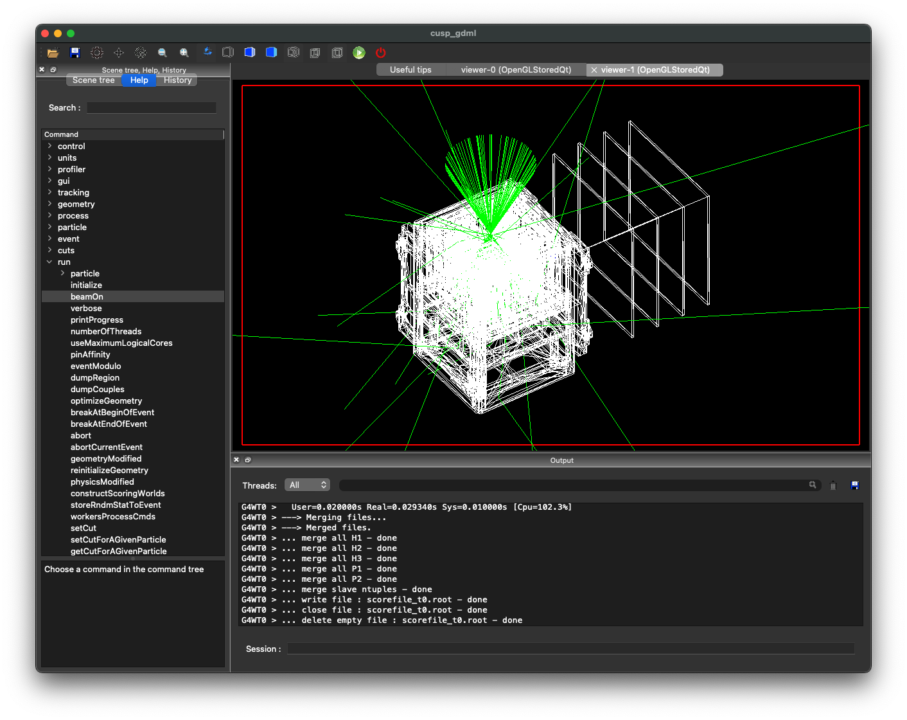

# g4cusp

__A GEANT4 code to simulate the CUSP detector__

The code is released under MIT licence. Please, read the `LICENCE` file in the root dir. The copyright notice shall be included in all copies or substantial portions of the Software.

__Disclamer:__ this code is under developement and the usage requires a basic understanding of how GEANT4 works.

## Citation

If you use results obtained with SIXTE in a publication, please cite as:

_De Cesare, G. et al. 2024 The evaluation of the CUSP scientific performance by a GEANT4 Monte Carlo simulation, Space Telescopes and Instrumentation 2024: Ultraviolet to Gamma Ray, 13093, 1309377._

## Usage

Interactive mode:
`./cusp_gdml`

Batch mode:
`./cusp_gdml batch.mac`

